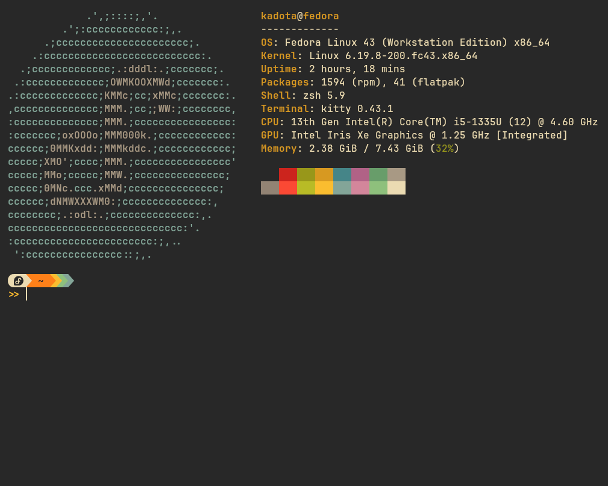

# 🖥️ Gruvbox Kitty-Terminal

> Setup completo do terminal **Kitty** com tema **Gruvbox** no **Fedora Linux (Laptop)**.

<p align="center">
  
</p>

<p align="center">
  
</p>

---

## 💻 Hardware

| Componente | Especificação |
|---|---|
| **CPU** | Intel Core i5-1335U (12 threads) @ 4.60 GHz |
| **RAM** | 8 GB (7.43 GiB disponível) |
| **GPU** | Intel Iris Xe Graphics (Integrada) |
| **OS** | Fedora Linux 43 (Workstation) x86_64 |
| **Terminal** | Kitty 0.43.1 |
| **Shell** | Zsh 5.9 |

---

## 📦 Stack

| Ferramenta | Função |
|---|---|
| [Kitty](https://sw.kovidgoyal.net/kitty/) | Emulador de terminal (GPU-accelerated) |
| [Zsh](https://www.zsh.org/) + [Oh My Zsh](https://ohmyz.sh/) | Shell interativo + framework de plugins |
| [Starship](https://starship.rs/) | Prompt customizável (Powerline pills) |
| [Fastfetch](https://github.com/fastfetch-cli/fastfetch) | System info na abertura do terminal |
| [Nerd Fonts](https://www.nerdfonts.com/) | Ícones e glifos no prompt (JetBrainsMono) |

---

## 📂 Estrutura

```
.
├── kitty/
│   └── kitty-fedora.conf       # Fonte, cursor, padding + paleta Gruvbox
├── zsh/
│   └── zshrc-fedora             # Oh My Zsh, plugins, aliases, starship init
├── starship/
│   └── starship-fedora.toml    # Prompt Starship estilo Gruvbox Rainbow
├── fastfetch/
│   └── fastfetch-fedora.jsonc  # Configuração do Fastfetch
└── IMG/
    ├── Fastfetch.png            # Screenshot do terminal
    └── Kitty.png                # Diagrama da arquitetura
```

---

## 📍 Locais de Configuração

| Arquivo no Repo | Destino no Sistema |
|---|---|
| `kitty/kitty-fedora.conf` | `~/.config/kitty/kitty.conf` |
| `zsh/zshrc-fedora` | `~/.zshrc` |
| `starship/starship-fedora.toml` | `~/.config/starship.toml` |
| `fastfetch/fastfetch-fedora.jsonc` | `~/.config/fastfetch/config.jsonc` |

---

## 🚀 Restauração Rápida

### Pré-requisitos

```bash
# Instalar dependências no Fedora
sudo dnf install kitty zsh fastfetch util-linux-user

# Instalar Oh My Zsh
sh -c "$(curl -fsSL https://raw.githubusercontent.com/ohmyzsh/ohmyzsh/master/tools/install.sh)"

# Instalar plugins do Zsh
git clone https://github.com/zsh-users/zsh-autosuggestions ${ZSH_CUSTOM:-~/.oh-my-zsh/custom}/plugins/zsh-autosuggestions
git clone https://github.com/zsh-users/zsh-syntax-highlighting ${ZSH_CUSTOM:-~/.oh-my-zsh/custom}/plugins/zsh-syntax-highlighting

# Instalar Starship
curl -sS https://starship.rs/install.sh | sh

# Instalar Nerd Font (JetBrainsMono)
# Baixe de https://www.nerdfonts.com/font-downloads
# Extraia os .ttf em ~/.local/share/fonts/ e execute:
fc-cache -fv

# Definir Zsh como shell padrão
chsh -s $(which zsh)
```

### Aplicar as configurações

```bash
# Clonar o repositório
git clone https://github.com/matheuskadota/Gruvbox_Kitty-Terminal.git
cd Gruvbox_Kitty-Terminal

# Kitty — fonte, cursor, padding + cores Gruvbox
mkdir -p ~/.config/kitty
cp kitty/kitty-fedora.conf ~/.config/kitty/kitty.conf

# Zsh — Oh My Zsh + plugins + aliases
cp zsh/zshrc-fedora ~/.zshrc

# Starship — prompt customizado
mkdir -p ~/.config
cp starship/starship-fedora.toml ~/.config/starship.toml

# Fastfetch — system info
mkdir -p ~/.config/fastfetch
cp fastfetch/fastfetch-fedora.jsonc ~/.config/fastfetch/config.jsonc
```

### Reiniciar o Kitty

```bash
# Feche e reabra o Kitty para ver tudo funcionando ✨
```

---

## 🎨 Paleta Gruvbox (Dark)

| Cor | Hex |
|---|---|
| Background | `#32302f` |
| Foreground | `#ebdbb2` |
| Red | `#fb4934` |
| Green | `#b8bb26` |
| Yellow | `#fabd2f` |
| Blue | `#83a598` |
| Purple | `#d3869b` |
| Aqua | `#8ec07c` |

---

## 📝 Notas

- A fonte **JetBrainsMono Nerd Font** é obrigatória para os ícones do Starship renderizarem corretamente.
- O `fastfetch` roda automaticamente ao abrir um novo terminal (configurado no `.zshrc`).
- O prompt Starship usa estilo **Powerline (pills)** com as cores Gruvbox.
- O Oh My Zsh fornece plugins de **autosuggestions** e **syntax-highlighting**.

---

<p align="center">
  Feito com ☕ por <a href="https://github.com/matheuskadota">@matheuskadota</a>
</p>
